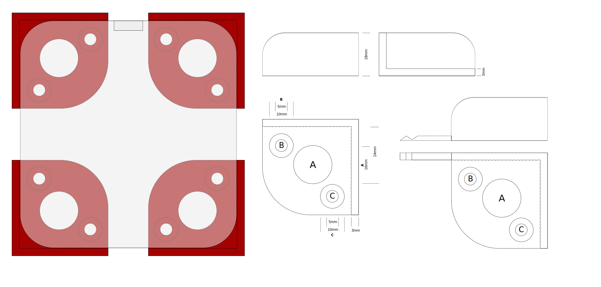

# Bracket for coralling desktop chargers
I have a few two way radios and the chargers are pretty light and slide around under my desk. I'd like to be able to temporarily attach them to a board or some other surface to organize cables and get them up off the floor.

I'd like to 3d print these brackets as a flexible system for this kind of task. These are designed around a Baofeng charger but I imagine they'd work for anything kind of similar shaped. We'll see how version one goes!

The big hole should accept the "foot" contour on the bottom of the charger. The angled corner should cope with me guessing wronng about the corner radius. My hope is that the little vanes on the bracket rails will give a pressfit snugness. But this might be too fussy a fit? The screw holes (B,C) are a wild assed guess and will need to get adjusted to real world screws.

